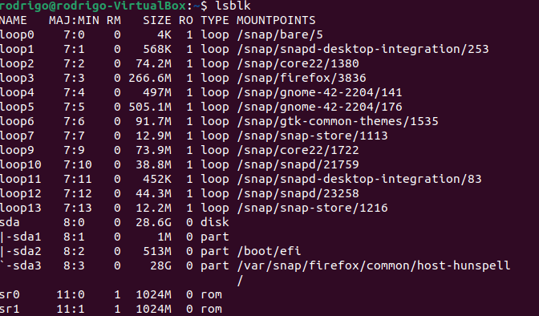
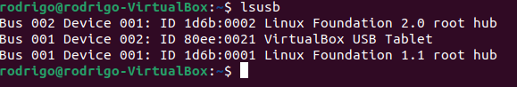
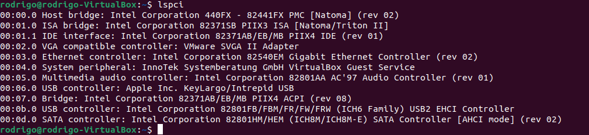
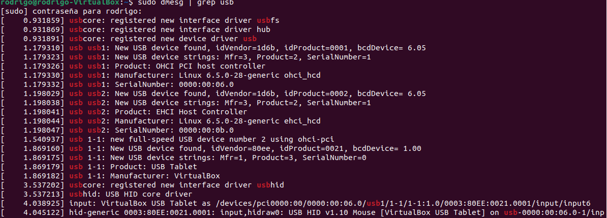
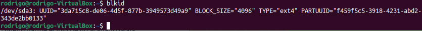
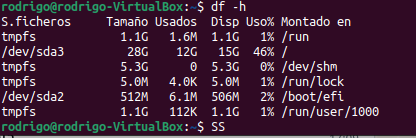
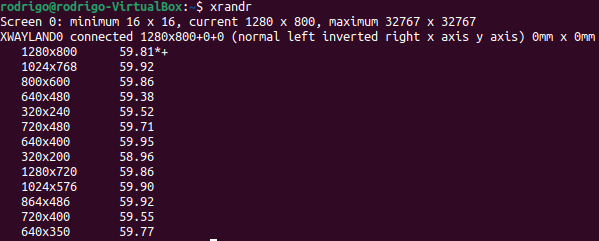
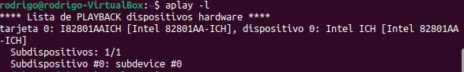
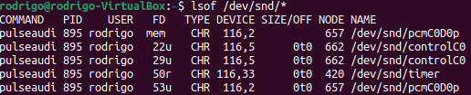

# ADMINISTRADOR DE ENTRDAS / SALIDAS EN LINUX 
## Alumno: Jesús Rodrigo Juárez Martinez
## Profesor: Jesús Eduardo Alcaraz Chavez
## Sistemas Operativos

### Actividad 1: Listar dispositivos conectados

En este ejercicio, aprenderá a listar, verificar y analizar los dispositivos de entrada y salida en Linux. Usarán comandos básicos y herramientas comunes disponibles en cualquier distribución.

#### 'lsblk'



#### 'lsusb'



#### 'lspci'



#### 'dmeseg | grep usb'



#### ¿Qué tipos de dispositivos se muestran en la salida de `lsblk`?

muestra información sobre dispositivos de bloques conectados al sistema. Los dispositivos de bloques son aquellos que permiten acceso a sus datos en bloques de tamaño fijo, lo que es típico de dispositivos de almacenamiento.

se muestra unidades de estado solido como en mi caso es sda, particiones de disco, dispositivos def almacenamiento usb, dispositivos opticos en este caso sr, volumenes logicos, dispositivos de bucle (loop), dispositivos RAM y dispositovos de almacenamiento virtuales, se muestra nombre, tamaño, ruta entre otras cosas.

#### ¿Cuál es la diferencia entre `lsusb` y `lspci`?

La diferencia principal entre lsusb y lspci radica en el tipo de dispositivos que cada comando lista en un sistema Linux.

1. lsusb: Lista dispositivos USB
Muestra información sobre los dispositivos conectados al bus USB del sistema.
Es útil para identificar memorias USB, teclados, ratones, impresoras, webcams, controladores de red USB, y otros dispositivos que utilicen una interfaz USB.
La información incluye ID de fabricante y producto, nombre del dispositivo, bus USB, y más.


La diferencia principal entre lsusb y lspci radica en el tipo de dispositivos que cada comando lista en un sistema Linux:

1. lsusb: 
- Lista dispositivos USB
- Muestra información sobre los dispositivos conectados al bus USB del sistema.
- Es útil para identificar memorias USB, teclados, ratones, impresoras, webcams, controladores de red USB, y otros dispositivos que utilicen una interfaz USB.
- La información incluye ID de fabricante y producto, nombre del dispositivo, bus USB, y más.

2. lspci: 
- Lista dispositivos PCI
- Muestra información sobre los dispositivos conectados al bus PCI del sistema.
- Incluye tarjetas de red, tarjetas gráficas (GPU), controladoras SATA, controladoras USB internas, tarjetas de sonido, dispositivos PCIe, etc.
- La información incluye ID del fabricante, modelo del dispositivo, y el bus PCI.

| **Característica**       | **lsusb**                            | **lspci**                              |
|--------------------------|--------------------------------------|----------------------------------------|
| **Lista**                | Dispositivos USB                    | Dispositivos PCI (internos)            |
| **Ejemplos de hardware** | Teclados, memorias USB, webcams, etc. | GPUs, tarjetas de red, audio, etc.     |
| **Buses**                | USB                                 | PCI / PCIe                             |
| **Nivel de conexión**    | Periféricos externos (principalmente) | Hardware interno                       |
| **Formato de salida**    | Bus, Device, ID del fabricante      | Bus PCI, tipo de dispositivo           |

#### ¿Qué información adicional proporciona `dmesg | grep usb`?

El comando dmesg | grep usb proporciona información adicional sobre eventos del kernel relacionados con dispositivos USB. Esta información se obtiene del buffer de mensajes del kernel y suele incluir detalles sobre...

1. Conexión y desconexión de dispositivos USB
- Registra cuándo un dispositivo USB fue conectado o desconectado.
- Muestra eventos en tiempo real con detalles como:
ID del dispositivo (ID de fabricante y producto).
- - Puerto USB donde está conectado.
- - Velocidad del enlace USB (alta, baja, o completa).
2. Errores y problemas con dispositivos USB
- Si hay algún error en la conexión o inicialización del dispositivo USB, aparecerá un mensaje.
Problemas comunes:
- - Dispositivo no reconocido.
- - Fallo de enumeración.
- - Problemas de suministro de energía o conexión.
3. Asignación de controladores y dispositivos USB
- Muestra cómo el kernel asigna controladores a dispositivos USB conectados.
- Indica el nombre del módulo o controlador USB que se está usando.

4. Velocidad del dispositivo USB
- Informa sobre la velocidad a la que el dispositivo USB está funcionando:
Low-Speed (1.5 Mbps, dispositivos simples como teclados).
Full-Speed (12 Mbps, dispositivos estándar).
High-Speed (480 Mbps, USB 2.0).
SuperSpeed (5 Gbps, USB 3.0).

5. Asignación de dispositivos de almacenamiento USB
- Si conectas una memoria USB, el kernel asignará un dispositivo de bloque (como /dev/sdb) y lo mostrará en la salida.

### Actividad 2: Verificar dispositivos de almacenamiento

Objetivo
Aprender cómo identificar discos duros, particiones y su configuración.

#### 'fdisk -l'

```bash
rodrigo@rodrigo-VirtualBox:~$ sudo fdisk -l
[sudo] contraseña para rodrigo: 
Disco /dev/loop0: 4 KiB, 4096 bytes, 8 sectores
Unidades: sectores de 1 * 512 = 512 bytes
Tamaño de sector (lógico/físico): 512 bytes / 512 bytes
Tamaño de E/S (mínimo/óptimo): 512 bytes / 512 bytes


Disco /dev/loop1: 568 KiB, 581632 bytes, 1136 sectores
Unidades: sectores de 1 * 512 = 512 bytes
Tamaño de sector (lógico/físico): 512 bytes / 512 bytes
Tamaño de E/S (mínimo/óptimo): 512 bytes / 512 bytes


Disco /dev/loop2: 74.24 MiB, 77844480 bytes, 152040 sectores
Unidades: sectores de 1 * 512 = 512 bytes
Tamaño de sector (lógico/físico): 512 bytes / 512 bytes
Tamaño de E/S (mínimo/óptimo): 512 bytes / 512 bytes


Disco /dev/loop3: 266.63 MiB, 279584768 bytes, 546064 sectores
Unidades: sectores de 1 * 512 = 512 bytes
Tamaño de sector (lógico/físico): 512 bytes / 512 bytes
Tamaño de E/S (mínimo/óptimo): 512 bytes / 512 bytes


Disco /dev/loop4: 496.98 MiB, 521121792 bytes, 1017816 sectores
Unidades: sectores de 1 * 512 = 512 bytes
Tamaño de sector (lógico/físico): 512 bytes / 512 bytes
Tamaño de E/S (mínimo/óptimo): 512 bytes / 512 bytes


Disco /dev/loop5: 505.09 MiB, 529625088 bytes, 1034424 sectores
Unidades: sectores de 1 * 512 = 512 bytes
Tamaño de sector (lógico/físico): 512 bytes / 512 bytes
Tamaño de E/S (mínimo/óptimo): 512 bytes / 512 bytes


Disco /dev/loop6: 91.69 MiB, 96141312 bytes, 187776 sectores
Unidades: sectores de 1 * 512 = 512 bytes
Tamaño de sector (lógico/físico): 512 bytes / 512 bytes
Tamaño de E/S (mínimo/óptimo): 512 bytes / 512 bytes


Disco /dev/loop7: 12.93 MiB, 13553664 bytes, 26472 sectores
Unidades: sectores de 1 * 512 = 512 bytes
Tamaño de sector (lógico/físico): 512 bytes / 512 bytes
Tamaño de E/S (mínimo/óptimo): 512 bytes / 512 bytes


Disco /dev/sda: 28.55 GiB, 30658740224 bytes, 59880352 sectores
Disk model: VBOX HARDDISK   
Unidades: sectores de 1 * 512 = 512 bytes
Tamaño de sector (lógico/físico): 512 bytes / 512 bytes
Tamaño de E/S (mínimo/óptimo): 512 bytes / 512 bytes
Tipo de etiqueta de disco: gpt
Identificador del disco: 1A400F06-8851-47AF-A69A-D268F8BBAD10

Dispositivo Comienzo    Final Sectores Tamaño Tipo
/dev/sda1       2048     4095     2048     1M Arranque de BIOS
/dev/sda2       4096  1054719  1050624   513M Sistema EFI
/dev/sda3    1054720 59879423 58824704    28G Sistema de ficheros de Linux


Disco /dev/loop9: 73.87 MiB, 77459456 bytes, 151288 sectores
Unidades: sectores de 1 * 512 = 512 bytes
Tamaño de sector (lógico/físico): 512 bytes / 512 bytes
Tamaño de E/S (mínimo/óptimo): 512 bytes / 512 bytes


Disco /dev/loop10: 38.83 MiB, 40714240 bytes, 79520 sectores
Unidades: sectores de 1 * 512 = 512 bytes
Tamaño de sector (lógico/físico): 512 bytes / 512 bytes
Tamaño de E/S (mínimo/óptimo): 512 bytes / 512 bytes


Disco /dev/loop11: 452 KiB, 462848 bytes, 904 sectores
Unidades: sectores de 1 * 512 = 512 bytes
Tamaño de sector (lógico/físico): 512 bytes / 512 bytes
Tamaño de E/S (mínimo/óptimo): 512 bytes / 512 bytes


Disco /dev/loop12: 44.3 MiB, 46448640 bytes, 90720 sectores
Unidades: sectores de 1 * 512 = 512 bytes
Tamaño de sector (lógico/físico): 512 bytes / 512 bytes
Tamaño de E/S (mínimo/óptimo): 512 bytes / 512 bytes


Disco /dev/loop13: 12.2 MiB, 12791808 bytes, 24984 sectores
Unidades: sectores de 1 * 512 = 512 bytes
Tamaño de sector (lógico/físico): 512 bytes / 512 bytes
Tamaño de E/S (mínimo/óptimo): 512 bytes / 512 bytes
```

#### 'blkid'



#### 'df -h'



#### ¿Qué dispositivos de almacenamiento están conectados a su sistema?
El /dev/sda es el único disco físico real conectado al sistema.
con un tamaño de 28.55 GiB con algunas particiones de sda1 (para la bios), sda2(Sistema EFI) y sda3 (Sistema de ficheros de linux).

Disco virtuales (loopback)
Estos dispositivos son archivos de imágenes montados por el sistema, generalmente para paquetes snap o imágenes del sistema.

#### ¿Qué particiones están montadas actualmente?

En la imagen del comando 'df -h' se muestra un par de particiones importantes sda3 y sda2.

La partición /dev/sda3 es la partición principal de tu sistema, montada como la raíz (/). Aquí es donde se almacenan todos los archivos del sistema operativo y la mayoría de los archivos de usuario. El sistema de archivos ext4 es uno de los más comunes en Linux y es conocido por su rendimiento, confiabilidad y características como la recuperación rápida de fallos y el soporte para grandes volúmenes y archivos.

La partición /dev/sda2 es la partición de arranque del sistema, montada en /boot/efi. Esta partición es parte del sistema de arranque UEFI (Unified Extensible Firmware Interface) y contiene los archivos necesarios para iniciar el sistema operativo en un entorno UEFI. El sistema de archivos vfat (FAT32) es utilizado en estas particiones por su compatibilidad con el firmware UEFI, permitiendo que el sistema operativo se cargue correctamente durante el arranque.

tmpfs es un sistema de archivos temporal que reside en la memoria RAM. Se utiliza para almacenar archivos temporales durante la ejecución del sistema. Este sistema es rápido porque no depende de un dispositivo de almacenamiento físico, y los datos se pierden cuando el sistema se apaga. Los puntos de montaje /run, /dev/shm, /run/lock y /run/user/1000 se utilizan para almacenar datos temporales del sistema, como archivos de configuración de ejecución, almacenamiento temporal compartido entre procesos, y archivos de bloqueo para evitar que múltiples procesos accedan a recursos compartidos de manera simultánea.

#### ¿Qué tipo de sistemas de archivos se usan en las particiones?

/dev/sda3

Tipo de sistema de archivos: ext4
Descripción:
El sistema de archivos ext4 (Fourth Extended File System) es uno de los más comunes en Linux. Es un sistema de archivos de propósito general, robusto y eficiente que soporta características como:
Alta capacidad para manejar grandes volúmenes de datos y archivos.
Soporte para la recuperación ante fallos.
Optimización de la gestión de inodos y el acceso a datos.
Uso de journaling, lo que ayuda a recuperar datos en caso de un apagón o fallo inesperado del sistema.

/dev/sda2

Tipo de sistema de archivos: vfat (FAT32)
Descripción:
El sistema de archivos vfat (Virtual File Allocation Table), también conocido como FAT32, es utilizado principalmente en particiones de arranque, especialmente en sistemas UEFI (Unified Extensible Firmware Interface). Las características del sistema vfat incluyen:
Alta compatibilidad con otros sistemas operativos (Windows, macOS, Linux).
Uso común en dispositivos de almacenamiento portátiles como memorias USB, discos duros externos, y en particiones de arranque UEFI.
Limitaciones en el tamaño de archivos y particiones (por ejemplo, un archivo individual no puede ser mayor de 4 GiB).

tmpfs

Tipo de sistema de archivos: tmpfs
Descripción:
tmpfs es un sistema de archivos en memoria (RAM). Los sistemas de archivos de tipo tmpfs se utilizan para almacenar datos temporales que no necesitan ser preservados después de reiniciar el sistema. Algunas características de tmpfs son:
Los datos se almacenan en la memoria RAM, lo que permite un acceso extremadamente rápido.
Cuando el sistema se apaga o reinicia, los datos almacenados en tmpfs se pierden.
Es utilizado por el sistema para almacenar archivos temporales, como archivos de configuración de procesos en ejecución o almacenamiento compartido entre aplicaciones.

### Actividad 3: Explorar dispositivos de entrada

Identificar dispositivos como teclados, ratones y cámaras.

'cat /proc/bus/input/devices'

```bash
rodrigo@rodrigo-VirtualBox:~$ cat /proc/bus/input/devices
I: Bus=0019 Vendor=0000 Product=0001 Version=0000
N: Name="Power Button"
P: Phys=LNXPWRBN/button/input0
S: Sysfs=/devices/LNXSYSTM:00/LNXPWRBN:00/input/input0
U: Uniq=
H: Handlers=kbd event0 
B: PROP=0
B: EV=3
B: KEY=10000000000000 0

I: Bus=0019 Vendor=0000 Product=0003 Version=0000
N: Name="Sleep Button"
P: Phys=LNXSLPBN/button/input0
S: Sysfs=/devices/LNXSYSTM:00/LNXSLPBN:00/input/input1
U: Uniq=
H: Handlers=kbd event1 
B: PROP=0
B: EV=3
B: KEY=4000 0 0

I: Bus=0011 Vendor=0001 Product=0001 Version=ab41
N: Name="AT Translated Set 2 keyboard"
P: Phys=isa0060/serio0/input0
S: Sysfs=/devices/platform/i8042/serio0/input/input2
U: Uniq=
H: Handlers=sysrq kbd event2 leds 
B: PROP=0
B: EV=120013
B: KEY=402000000 3803078f800d001 feffffdfffefffff fffffffffffffffe
B: MSC=10
B: LED=7

I: Bus=0019 Vendor=0000 Product=0006 Version=0000
N: Name="Video Bus"
P: Phys=LNXVIDEO/video/input0
S: Sysfs=/devices/LNXSYSTM:00/LNXSYBUS:00/PNP0A03:00/LNXVIDEO:00/input/input4
U: Uniq=
H: Handlers=kbd event3 
B: PROP=0
B: EV=3
B: KEY=3e000b00000000 0 0 0

I: Bus=0011 Vendor=0002 Product=0006 Version=0000
N: Name="ImExPS/2 Generic Explorer Mouse"
P: Phys=isa0060/serio1/input0
S: Sysfs=/devices/platform/i8042/serio1/input/input5
U: Uniq=
H: Handlers=mouse0 event4 
B: PROP=1
B: EV=7
B: KEY=1f0000 0 0 0 0
B: REL=143

I: Bus=0003 Vendor=80ee Product=0021 Version=0110
N: Name="VirtualBox USB Tablet"
P: Phys=usb-0000:00:06.0-1/input0
S: Sysfs=/devices/pci0000:00/0000:00:06.0/usb1/1-1/1-1:1.0/0003:80EE:0021.0001/input/input6
U: Uniq=
H: Handlers=mouse1 event5 js0 
B: PROP=0
B: EV=1f
B: KEY=1f0000 0 0 0 0
B: REL=1940
B: ABS=3
B: MSC=10

I: Bus=0001 Vendor=80ee Product=cafe Version=0000
N: Name="VirtualBox mouse integration"
P: Phys=
S: Sysfs=/devices/pci0000:00/0000:00:04.0/input/input7
U: Uniq=
H: Handlers=mouse2 event6 js1 
B: PROP=0
B: EV=b
B: KEY=10000 0 0 0 0
B: ABS=3
```

'evtest'
- Teclado
```bash
rodrigo@rodrigo-VirtualBox:~$ sudo evtest
No device specified, trying to scan all of /dev/input/event*
Available devices:
/dev/input/event0:	Power Button
/dev/input/event1:	Sleep Button
/dev/input/event2:	AT Translated Set 2 keyboard
/dev/input/event3:	Video Bus
/dev/input/event4:	ImExPS/2 Generic Explorer Mouse
/dev/input/event5:	VirtualBox USB Tablet
/dev/input/event6:	VirtualBox mouse integration
Select the device event number [0-6]: 2
Input driver version is 1.0.1
Input device ID: bus 0x11 vendor 0x1 product 0x1 version 0xab41
Input device name: "AT Translated Set 2 keyboard"
Supported events:
  Event type 0 (EV_SYN)
  Event type 1 (EV_KEY)
    Event code 1 (KEY_ESC)
    Event code 2 (KEY_1)
    Event code 3 (KEY_2)
    Event code 4 (KEY_3)
    Event code 5 (KEY_4)
    Event code 6 (KEY_5)
    Event code 7 (KEY_6)
    Event code 8 (KEY_7)
    Event code 9 (KEY_8)
    Event code 10 (KEY_9)
    Event code 11 (KEY_0)
    Event code 12 (KEY_MINUS)
    Event code 13 (KEY_EQUAL)
    Event code 14 (KEY_BACKSPACE)
    Event code 15 (KEY_TAB)
    Event code 16 (KEY_Q)
    Event code 17 (KEY_W)
    Event code 18 (KEY_E)
    Event code 19 (KEY_R)
    Event code 20 (KEY_T)
    Event code 21 (KEY_Y)
    Event code 22 (KEY_U)
    Event code 23 (KEY_I)
    Event code 24 (KEY_O)
    Event code 25 (KEY_P)
    Event code 26 (KEY_LEFTBRACE)
    Event code 27 (KEY_RIGHTBRACE)
    Event code 28 (KEY_ENTER)
    Event code 29 (KEY_LEFTCTRL)
    Event code 30 (KEY_A)
    Event code 31 (KEY_S)
    Event code 32 (KEY_D)
    Event code 33 (KEY_F)
    Event code 34 (KEY_G)
    Event code 35 (KEY_H)
    Event code 36 (KEY_J)
    Event code 37 (KEY_K)
    Event code 38 (KEY_L)
    Event code 39 (KEY_SEMICOLON)
    Event code 40 (KEY_APOSTROPHE)
    Event code 41 (KEY_GRAVE)
    Event code 42 (KEY_LEFTSHIFT)
    Event code 43 (KEY_BACKSLASH)
    Event code 44 (KEY_Z)
    Event code 45 (KEY_X)
    Event code 46 (KEY_C)
    Event code 47 (KEY_V)
    Event code 48 (KEY_B)
    Event code 49 (KEY_N)
    Event code 50 (KEY_M)
    Event code 51 (KEY_COMMA)
    Event code 52 (KEY_DOT)
    Event code 53 (KEY_SLASH)
    Event code 54 (KEY_RIGHTSHIFT)
    Event code 55 (KEY_KPASTERISK)
    Event code 56 (KEY_LEFTALT)
    Event code 57 (KEY_SPACE)
    Event code 58 (KEY_CAPSLOCK)
    Event code 59 (KEY_F1)
    Event code 60 (KEY_F2)
    Event code 61 (KEY_F3)
    Event code 62 (KEY_F4)
    Event code 63 (KEY_F5)
    Event code 64 (KEY_F6)
    Event code 65 (KEY_F7)
    Event code 66 (KEY_F8)
    Event code 67 (KEY_F9)
    Event code 68 (KEY_F10)
    Event code 69 (KEY_NUMLOCK)
    Event code 70 (KEY_SCROLLLOCK)
    Event code 71 (KEY_KP7)
    Event code 72 (KEY_KP8)
    Event code 73 (KEY_KP9)
    Event code 74 (KEY_KPMINUS)
    Event code 75 (KEY_KP4)
    Event code 76 (KEY_KP5)
    Event code 77 (KEY_KP6)
    Event code 78 (KEY_KPPLUS)
    Event code 79 (KEY_KP1)
    Event code 80 (KEY_KP2)
    Event code 81 (KEY_KP3)
    Event code 82 (KEY_KP0)
    Event code 83 (KEY_KPDOT)
    Event code 85 (KEY_ZENKAKUHANKAKU)
    Event code 86 (KEY_102ND)
    Event code 87 (KEY_F11)
    Event code 88 (KEY_F12)
    Event code 89 (KEY_RO)
    Event code 90 (KEY_KATAKANA)
    Event code 91 (KEY_HIRAGANA)
    Event code 92 (KEY_HENKAN)
    Event code 93 (KEY_KATAKANAHIRAGANA)
    Event code 94 (KEY_MUHENKAN)
    Event code 95 (KEY_KPJPCOMMA)
    Event code 96 (KEY_KPENTER)
    Event code 97 (KEY_RIGHTCTRL)
    Event code 98 (KEY_KPSLASH)
    Event code 99 (KEY_SYSRQ)
    Event code 100 (KEY_RIGHTALT)
    Event code 102 (KEY_HOME)
    Event code 103 (KEY_UP)
    Event code 104 (KEY_PAGEUP)
    Event code 105 (KEY_LEFT)
    Event code 106 (KEY_RIGHT)
    Event code 107 (KEY_END)
    Event code 108 (KEY_DOWN)
    Event code 109 (KEY_PAGEDOWN)
    Event code 110 (KEY_INSERT)
    Event code 111 (KEY_DELETE)
    Event code 112 (KEY_MACRO)
    Event code 113 (KEY_MUTE)
    Event code 114 (KEY_VOLUMEDOWN)
    Event code 115 (KEY_VOLUMEUP)
    Event code 116 (KEY_POWER)
    Event code 117 (KEY_KPEQUAL)
    Event code 118 (KEY_KPPLUSMINUS)
    Event code 119 (KEY_PAUSE)
    Event code 121 (KEY_KPCOMMA)
    Event code 122 (KEY_HANGUEL)
    Event code 123 (KEY_HANJA)
    Event code 124 (KEY_YEN)
    Event code 125 (KEY_LEFTMETA)
    Event code 126 (KEY_RIGHTMETA)
    Event code 127 (KEY_COMPOSE)
    Event code 128 (KEY_STOP)
    Event code 140 (KEY_CALC)
    Event code 142 (KEY_SLEEP)
    Event code 143 (KEY_WAKEUP)
    Event code 155 (KEY_MAIL)
    Event code 156 (KEY_BOOKMARKS)
    Event code 157 (KEY_COMPUTER)
    Event code 158 (KEY_BACK)
    Event code 159 (KEY_FORWARD)
    Event code 163 (KEY_NEXTSONG)
    Event code 164 (KEY_PLAYPAUSE)
    Event code 165 (KEY_PREVIOUSSONG)
    Event code 166 (KEY_STOPCD)
    Event code 172 (KEY_HOMEPAGE)
    Event code 173 (KEY_REFRESH)
    Event code 183 (KEY_F13)
    Event code 184 (KEY_F14)
    Event code 185 (KEY_F15)
    Event code 217 (KEY_SEARCH)
    Event code 226 (KEY_MEDIA)
  Event type 4 (EV_MSC)
    Event code 4 (MSC_SCAN)
  Event type 17 (EV_LED)
    Event code 0 (LED_NUML) state 0
    Event code 1 (LED_CAPSL) state 0
    Event code 2 (LED_SCROLLL) state 0
Key repeat handling:
  Repeat type 20 (EV_REP)
    Repeat code 0 (REP_DELAY)
      Value    250
    Repeat code 1 (REP_PERIOD)
      Value     33
Properties:
Testing ... (interrupt to exit)
Event: time 1734397793.621180, type 4 (EV_MSC), code 4 (MSC_SCAN), value 1c
Event: time 1734397793.621180, type 1 (EV_KEY), code 28 (KEY_ENTER), value 0
Event: time 1734397793.621180, -------------- SYN_REPORT ------------
Event: time 1734397803.823129, type 4 (EV_MSC), code 4 (MSC_SCAN), value c8
Event: time 1734397803.823129, type 1 (EV_KEY), code 103 (KEY_UP), value 1
Event: time 1734397803.823129, -------------- SYN_REPORT ------------
^[[AEvent: time 1734397803.959658, type 4 (EV_MSC), code 4 (MSC_SCAN), value c8
Event: time 1734397803.959658, type 1 (EV_KEY), code 103 (KEY_UP), value 0
Event: time 1734397803.959658, -------------- SYN_REPORT ------------
Event: time 1734397805.321969, type 4 (EV_MSC), code 4 (MSC_SCAN), value cd
Event: time 1734397805.321969, type 1 (EV_KEY), code 106 (KEY_RIGHT), value 1
Event: time 1734397805.321969, -------------- SYN_REPORT ------------
^[[CEvent: time 1734397805.467240, type 4 (EV_MSC), code 4 (MSC_SCAN), value cd
Event: time 1734397805.467240, type 1 (EV_KEY), code 106 (KEY_RIGHT), value 0
Event: time 1734397805.467240, -------------- SYN_REPORT ------------
```

- Mouse

```bash
rodrigo@rodrigo-VirtualBox:~$ sudo evtest
No device specified, trying to scan all of /dev/input/event*
Available devices:
/dev/input/event0:	Power Button
/dev/input/event1:	Sleep Button
/dev/input/event2:	AT Translated Set 2 keyboard
/dev/input/event3:	Video Bus
/dev/input/event4:	ImExPS/2 Generic Explorer Mouse
/dev/input/event5:	VirtualBox USB Tablet
/dev/input/event6:	VirtualBox mouse integration
Select the device event number [0-6]: 6
Input driver version is 1.0.1
Input device ID: bus 0x1 vendor 0x80ee product 0xcafe version 0x0
Input device name: "VirtualBox mouse integration"
Supported events:
  Event type 0 (EV_SYN)
  Event type 1 (EV_KEY)
    Event code 272 (BTN_LEFT)
  Event type 3 (EV_ABS)
    Event code 0 (ABS_X)
      Value  32165
      Min        0
      Max    65535
    Event code 1 (ABS_Y)
      Value  45157
      Min        0
      Max    65535
Properties:
Testing ... (interrupt to exit)
Event: time 1734398017.030952, type 3 (EV_ABS), code 0 (ABS_X), value 32063
Event: time 1734398017.030952, -------------- SYN_REPORT ------------
Event: time 1734398018.335202, type 3 (EV_ABS), code 0 (ABS_X), value 32012
Event: time 1734398018.335202, -------------- SYN_REPORT ------------
Event: time 1734398018.343280, type 3 (EV_ABS), code 1 (ABS_Y), value 45239
Event: time 1734398018.343280, -------------- SYN_REPORT ------------
Event: time 1734398018.350808, type 3 (EV_ABS), code 0 (ABS_X), value 32063
Event: time 1734398018.350808, type 3 (EV_ABS), code 1 (ABS_Y), value 45403
Event: time 1734398018.350808, -------------- SYN_REPORT ------------
Event: time 1734398018.358892, type 3 (EV_ABS), code 0 (ABS_X), value 32114
Event: time 1734398018.358892, type 3 (EV_ABS), code 1 (ABS_Y), value 45567
Event: time 1734398018.358892, -------------- SYN_REPORT ------------
Event: time 1734398018.366892, type 3 (EV_ABS), code 0 (ABS_X), value 32165
Event: time 1734398018.366892, type 3 (EV_ABS), code 1 (ABS_Y), value 45731
Event: time 1734398018.366892, -------------- SYN_REPORT ------------
Event: time 1734398018.374878, type 3 (EV_ABS), code 1 (ABS_Y), value 45813
Event: time 1734398018.374878, -------------- SYN_REPORT ------------
Event: time 1734398018.384909, type 3 (EV_ABS), code 0 (ABS_X), value 32217
Event: time 1734398018.384909, type 3 (EV_ABS), code 1 (ABS_Y), value 45894
Event: time 1734398018.384909, -------------- SYN_REPORT ------------
Event: time 1734398018.398836, type 3 (EV_ABS), code 0 (ABS_X), value 32268
Event: time 1734398018.398836, type 3 (EV_ABS), code 1 (ABS_Y), value 46140
Event: time 1734398018.398836, -------------- SYN_REPORT ------------
Event: time 1734398018.406845, type 3 (EV_ABS), code 1 (ABS_Y), value 46222
Event: time 1734398018.406845, -------------- SYN_REPORT ------------
Event: time 1734398018.414912, type 3 (EV_ABS), code 1 (ABS_Y), value 46304
Event: time 1734398018.414912, -------------- SYN_REPORT ------------
Event: time 1734398018.423572, type 3 (EV_ABS), code 1 (ABS_Y), value 46386
Event: time 1734398018.423572, -------------- SYN_REPORT ------------
Event: time 1734398018.430932, type 3 (EV_ABS), code 1 (ABS_Y), value 46550
Event: time 1734398018.430932, -------------- SYN_REPORT ------------
```

- Controladores USB adicionales

```bash
rodrigo@rodrigo-VirtualBox:~$ sudo evtest
No device specified, trying to scan all of /dev/input/event*
Available devices:
/dev/input/event0:	Power Button
/dev/input/event1:	Sleep Button
/dev/input/event2:	AT Translated Set 2 keyboard
/dev/input/event3:	Video Bus
/dev/input/event4:	ImExPS/2 Generic Explorer Mouse
/dev/input/event5:	VirtualBox USB Tablet
/dev/input/event6:	VirtualBox mouse integration
Select the device event number [0-6]: 5
Input driver version is 1.0.1
Input device ID: bus 0x3 vendor 0x80ee product 0x21 version 0x110
Input device name: "VirtualBox USB Tablet"
Supported events:
  Event type 0 (EV_SYN)
  Event type 1 (EV_KEY)
    Event code 272 (BTN_LEFT)
    Event code 273 (BTN_RIGHT)
    Event code 274 (BTN_MIDDLE)
    Event code 275 (BTN_SIDE)
    Event code 276 (BTN_EXTRA)
  Event type 2 (EV_REL)
    Event code 6 (REL_HWHEEL)
    Event code 8 (REL_WHEEL)
    Event code 11 (REL_WHEEL_HI_RES)
    Event code 12 (REL_HWHEEL_HI_RES)
  Event type 3 (EV_ABS)
    Event code 0 (ABS_X)
      Value      0
      Min        0
      Max    32767
    Event code 1 (ABS_Y)
      Value      0
      Min        0
      Max    32767
  Event type 4 (EV_MSC)
    Event code 4 (MSC_SCAN)
Properties:
Testing ... (interrupt to exit)
```

#### ¿Qué eventos genera cada dispositivo al interactuar con ellos?

En evtest, cada dispositivo de entrada genera eventos que están relacionados con las acciones del usuario. Estos eventos se capturan y se muestran en tiempo real cuando se interactúa con los dispositivos.

Power Button (/dev/input/event0):

Este dispositivo genera un evento cuando se presiona el botón de encendido. Los eventos más comunes son de tipo EV_KEY con los valores KEY_POWER o KEY_WAKEUP.

Sleep Button (/dev/input/event1):

Similar al botón de encendido, este dispositivo genera un evento cuando se presiona el botón de suspensión. Los eventos típicos son también de tipo EV_KEY con los valores KEY_SLEEP.

AT Translated Set 2 Keyboard (/dev/input/event2):

Los eventos generados por el teclado son principalmente de tipo EV_KEY, que indican la presión y liberación de teclas. Por ejemplo:
KEY_A, KEY_B, etc., cuando se presionan las teclas.
EV_KEY también se utiliza para las teclas modificadoras como SHIFT, CTRL, etc.
Además, se pueden generar eventos de tipo EV_MSC si el teclado tiene teclas especiales o multimedia.

Video Bus (/dev/input/event3):

Este dispositivo genera eventos relacionados con la entrada de video o eventos de hardware de la pantalla, como la conexión o desconexión de monitores. Estos eventos son típicamente de tipo EV_ABS o EV_SYN y se usan en el contexto de la configuración o gestión de pantallas.

ImExPS/2 Generic Explorer Mouse (/dev/input/event4):

Este mouse genera eventos de tipo EV_REL para el movimiento del puntero (REL_X, REL_Y) y eventos de tipo EV_KEY para las pulsaciones de botones del mouse, como el clic izquierdo (BTN_LEFT) y clic derecho (BTN_RIGHT).

VirtualBox USB Tablet (/dev/input/event5):

Este dispositivo emula una tablet USB virtualizada. Genera eventos de tipo EV_ABS para el movimiento táctil en coordenadas (ABS_X, ABS_Y) y de tipo EV_KEY para las pulsaciones de botones, como BTN_TOUCH para la interacción táctil.

VirtualBox Mouse Integration (/dev/input/event6):

Este dispositivo está relacionado con la integración del mouse en la máquina virtual. Similar al dispositivo del mouse físico, genera eventos de tipo EV_REL para el movimiento del mouse y EV_KEY para las pulsaciones de los botones del mouse.

#### ¿Cómo se identifican los dispositivos en `/proc/bus/input/devices`?

El archivo /proc/bus/input/devices contiene información detallada sobre todos los dispositivos de entrada conectados al sistema. Cada dispositivo está identificado por una serie de campos:

Name: El nombre del dispositivo de entrada. Este nombre generalmente indica el tipo de dispositivo, como "keyboard", "mouse", "tablet", etc.

Phys: El nombre físico del dispositivo (generalmente no es relevante para la mayoría de los usuarios, pero puede ser útil para identificar el dispositivo en términos de su puerto o conexión).

Event: Este campo muestra el archivo de evento asociado al dispositivo, como /dev/input/event0, que corresponde al dispositivo de entrada específico.

Capabilities: Indica qué tipos de eventos puede generar el dispositivo. Los dispositivos pueden generar diferentes tipos de eventos, como EV_KEY (teclas), EV_REL (movimiento relativo, como el movimiento del mouse), EV_ABS (eventos relativos a coordenadas, como el toque en pantallas táctiles), etc.

Phys: Dirección física del dispositivo (por ejemplo, puerto USB).

Handlers: Los controladores asociados al dispositivo.

En resumen, cada dispositivo tiene una entrada que describe su tipo, las capacidades de los eventos que puede generar y el archivo de evento relacionado. A través de esta información, puedes identificar y monitorear los eventos de entrada en el sistema.

### Actividad 4: Examinar dispositivos de salida.

Entender cómo identificar dispositivos de salida como monitores y tarjetas de sonido.

'xrandr'



'aplay -l'



'lsof /dev/snd/*'



#### ¿Qué salidas de video están disponibles en su sistema?
se puede ver solamente una pantalla con diferentes resoluciones donde se usa una ahora mismo de 1280 x 800, con un maximo a 32767 x 32767. 
#### ¿Qué dispositivos de sonido se detectaron?
se detecto solo un dispositivo, el de la tarjeta, el cual se puede observar la marca en este caso Intel.
#### ¿Qué procesos están usando la tarjeta de sonido? 
varios procesos con el mismo PID 895 y diferentes rutas o nombres.

### Actividad 5: Crear un script de resumen

Automatizar la recopilación de información de dispositivos de entrada y salida.

Esta es la salida de la consola terminando todos los pasos.

```bash
rodrigo@rodrigo-VirtualBox:~$ nano dispositivos.sh
rodrigo@rodrigo-VirtualBox:~$ nano dispositivos.sh
rodrigo@rodrigo-VirtualBox:~$ bash dispositivos.sh
bash: dispositivos.sh#!/bin/bash: No existe el archivo o el directorio
dispositivos.sh: línea 13: resumendispositivos.txt#!/bin/bash: No existe el archivo o el directorio
Dispositivos de bloque:
NAME   MAJ:MIN RM   SIZE RO TYPE MOUNTPOINTS
loop0    7:0    0     4K  1 loop /snap/bare/5
loop1    7:1    0   568K  1 loop /snap/snapd-desktop-integration/253
loop2    7:2    0  74.2M  1 loop /snap/core22/1380
loop3    7:3    0 266.6M  1 loop /snap/firefox/3836
loop4    7:4    0   497M  1 loop /snap/gnome-42-2204/141
loop5    7:5    0 505.1M  1 loop /snap/gnome-42-2204/176
loop6    7:6    0  91.7M  1 loop /snap/gtk-common-themes/1535
loop7    7:7    0  12.9M  1 loop /snap/snap-store/1113
loop9    7:9    0  73.9M  1 loop /snap/core22/1722
loop10   7:10   0  38.8M  1 loop /snap/snapd/21759
loop11   7:11   0   452K  1 loop /snap/snapd-desktop-integration/83
loop12   7:12   0  44.3M  1 loop /snap/snapd/23258
loop13   7:13   0  12.2M  1 loop /snap/snap-store/1216
sda      8:0    0  28.6G  0 disk 
├─sda1   8:1    0     1M  0 part 
├─sda2   8:2    0   513M  0 part /boot/efi
└─sda3   8:3    0    28G  0 part /var/snap/firefox/common/host-hunspell
                                 /
sr0     11:0    1  1024M  0 rom  
sr1     11:1    1  1024M  0 rom  
Dispositivos USB:
Bus 002 Device 001: ID 1d6b:0002 Linux Foundation 2.0 root hub
Bus 001 Device 002: ID 80ee:0021 VirtualBox USB Tablet
Bus 001 Device 001: ID 1d6b:0001 Linux Foundation 1.1 root hub
Dispositivos PCI:
00:00.0 Host bridge: Intel Corporation 440FX - 82441FX PMC [Natoma] (rev 02)
00:01.0 ISA bridge: Intel Corporation 82371SB PIIX3 ISA [Natoma/Triton II]
00:01.1 IDE interface: Intel Corporation 82371AB/EB/MB PIIX4 IDE (rev 01)
00:02.0 VGA compatible controller: VMware SVGA II Adapter
00:03.0 Ethernet controller: Intel Corporation 82540EM Gigabit Ethernet Controller (rev 02)
00:04.0 System peripheral: InnoTek Systemberatung GmbH VirtualBox Guest Service
00:05.0 Multimedia audio controller: Intel Corporation 82801AA AC'97 Audio Controller (rev 01)
00:06.0 USB controller: Apple Inc. KeyLargo/Intrepid USB
00:07.0 Bridge: Intel Corporation 82371AB/EB/MB PIIX4 ACPI (rev 08)
00:0b.0 USB controller: Intel Corporation 82801FB/FBM/FR/FW/FRW (ICH6 Family) USB2 EHCI Controller
00:0d.0 SATA controller: Intel Corporation 82801HM/HEM (ICH8M/ICH8M-E) SATA Controller [AHCI mode] (rev 02)
Dispositivos de entrada:
I: Bus=0019 Vendor=0000 Product=0001 Version=0000
N: Name="Power Button"
P: Phys=LNXPWRBN/button/input0
S: Sysfs=/devices/LNXSYSTM:00/LNXPWRBN:00/input/input0
U: Uniq=
H: Handlers=kbd event0 
B: PROP=0
B: EV=3
B: KEY=10000000000000 0

I: Bus=0019 Vendor=0000 Product=0003 Version=0000
N: Name="Sleep Button"
P: Phys=LNXSLPBN/button/input0
S: Sysfs=/devices/LNXSYSTM:00/LNXSLPBN:00/input/input1
U: Uniq=
H: Handlers=kbd event1 
B: PROP=0
B: EV=3
B: KEY=4000 0 0

I: Bus=0011 Vendor=0001 Product=0001 Version=ab41
N: Name="AT Translated Set 2 keyboard"
P: Phys=isa0060/serio0/input0
S: Sysfs=/devices/platform/i8042/serio0/input/input2
U: Uniq=
H: Handlers=sysrq kbd event2 leds 
B: PROP=0
B: EV=120013
B: KEY=402000000 3803078f800d001 feffffdfffefffff fffffffffffffffe
B: MSC=10
B: LED=7

I: Bus=0019 Vendor=0000 Product=0006 Version=0000
N: Name="Video Bus"
P: Phys=LNXVIDEO/video/input0
S: Sysfs=/devices/LNXSYSTM:00/LNXSYBUS:00/PNP0A03:00/LNXVIDEO:00/input/input4
U: Uniq=
H: Handlers=kbd event3 
B: PROP=0
B: EV=3
B: KEY=3e000b00000000 0 0 0

I: Bus=0011 Vendor=0002 Product=0006 Version=0000
N: Name="ImExPS/2 Generic Explorer Mouse"
P: Phys=isa0060/serio1/input0
S: Sysfs=/devices/platform/i8042/serio1/input/input5
U: Uniq=
H: Handlers=mouse0 event4 
B: PROP=1
B: EV=7
B: KEY=1f0000 0 0 0 0
B: REL=143

I: Bus=0003 Vendor=80ee Product=0021 Version=0110
N: Name="VirtualBox USB Tablet"
P: Phys=usb-0000:00:06.0-1/input0
S: Sysfs=/devices/pci0000:00/0000:00:06.0/usb1/1-1/1-1:1.0/0003:80EE:0021.0001/input/input6
U: Uniq=
H: Handlers=mouse1 event5 js0 
B: PROP=0
B: EV=1f
B: KEY=1f0000 0 0 0 0
B: REL=1940
B: ABS=3
B: MSC=10

I: Bus=0001 Vendor=80ee Product=cafe Version=0000
N: Name="VirtualBox mouse integration"
P: Phys=
S: Sysfs=/devices/pci0000:00/0000:00:04.0/input/input7
U: Uniq=
H: Handlers=mouse2 event6 js1 
B: PROP=0
B: EV=b
B: KEY=10000 0 0 0 0
B: ABS=3

Salidas de video:
Screen 0: minimum 16 x 16, current 1280 x 800, maximum 32767 x 32767
XWAYLAND0 connected primary 1280x800+0+0 (normal left inverted right x axis y axis) 0mm x 0mm
   1280x800      59.81*+
   1024x768      59.92  
   800x600       59.86  
   640x480       59.38  
   320x240       59.52  
   720x480       59.71  
   640x400       59.95  
   320x200       58.96  
   1280x720      59.86  
   1024x576      59.90  
   864x486       59.92  
   720x400       59.55  
   640x350       59.77  
Tarjetas de sonido:
** Lista de PLAYBACK dispositivos hardware **
tarjeta 0: I82801AAICH [Intel 82801AA-ICH], dispositivo 0: Intel ICH [Intel 82801AA-ICH]
  Subdispositivos: 1/1
  Subdispositivo #0: subdevice #0
```

- dispositivos.sh 

```bash
bash dispositivos.sh#!/bin/bash
echo "Dispositivos de bloque:" > resumendispositivos.txt
lsblk >> resumendispositivos.txt
echo "Dispositivos USB:" >> resumendispositivos.txt
lsusb >> resumendispositivos.txt
echo "Dispositivos PCI:" >> resumendispositivos.txt
lspci >> resumendispositivos.txt
echo "Dispositivos de entrada:" >> resumendispositivos.txt
cat /proc/bus/input/devices >> resumendispositivos.txt
echo "Salidas de video:" >> resumendispositivos.txt
xrandr >> resumendispositivos.txt
echo "Tarjetas de sonido:" >> resumendispositivos.txt
aplay -l >> resumendispositivos.txt#!/bin/bash
echo "Dispositivos de bloque:" 
lsblk
echo "Dispositivos USB:" 
lsusb
echo "Dispositivos PCI:" 
lspci
echo "Dispositivos de entrada:" 
cat /proc/bus/input/devices
echo "Salidas de video:" 
xrandr
echo "Tarjetas de sonido:" 
aplay -l
```

- resumendispositivos.txt

```
Dispositivos de bloque:
NAME   MAJ:MIN RM   SIZE RO TYPE MOUNTPOINTS
loop0    7:0    0     4K  1 loop /snap/bare/5
loop1    7:1    0   568K  1 loop /snap/snapd-desktop-integration/253
loop2    7:2    0  74.2M  1 loop /snap/core22/1380
loop3    7:3    0 266.6M  1 loop /snap/firefox/3836
loop4    7:4    0   497M  1 loop /snap/gnome-42-2204/141
loop5    7:5    0 505.1M  1 loop /snap/gnome-42-2204/176
loop6    7:6    0  91.7M  1 loop /snap/gtk-common-themes/1535
loop7    7:7    0  12.9M  1 loop /snap/snap-store/1113
loop9    7:9    0  73.9M  1 loop /snap/core22/1722
loop10   7:10   0  38.8M  1 loop /snap/snapd/21759
loop11   7:11   0   452K  1 loop /snap/snapd-desktop-integration/83
loop12   7:12   0  44.3M  1 loop /snap/snapd/23258
loop13   7:13   0  12.2M  1 loop /snap/snap-store/1216
sda      8:0    0  28.6G  0 disk 
├─sda1   8:1    0     1M  0 part 
├─sda2   8:2    0   513M  0 part /boot/efi
└─sda3   8:3    0    28G  0 part /var/snap/firefox/common/host-hunspell
                                 /
sr0     11:0    1  1024M  0 rom  
sr1     11:1    1  1024M  0 rom  
Dispositivos USB:
Bus 002 Device 001: ID 1d6b:0002 Linux Foundation 2.0 root hub
Bus 001 Device 002: ID 80ee:0021 VirtualBox USB Tablet
Bus 001 Device 001: ID 1d6b:0001 Linux Foundation 1.1 root hub
Dispositivos PCI:
00:00.0 Host bridge: Intel Corporation 440FX - 82441FX PMC [Natoma] (rev 02)
00:01.0 ISA bridge: Intel Corporation 82371SB PIIX3 ISA [Natoma/Triton II]
00:01.1 IDE interface: Intel Corporation 82371AB/EB/MB PIIX4 IDE (rev 01)
00:02.0 VGA compatible controller: VMware SVGA II Adapter
00:03.0 Ethernet controller: Intel Corporation 82540EM Gigabit Ethernet Controller (rev 02)
00:04.0 System peripheral: InnoTek Systemberatung GmbH VirtualBox Guest Service
00:05.0 Multimedia audio controller: Intel Corporation 82801AA AC'97 Audio Controller (rev 01)
00:06.0 USB controller: Apple Inc. KeyLargo/Intrepid USB
00:07.0 Bridge: Intel Corporation 82371AB/EB/MB PIIX4 ACPI (rev 08)
00:0b.0 USB controller: Intel Corporation 82801FB/FBM/FR/FW/FRW (ICH6 Family) USB2 EHCI Controller
00:0d.0 SATA controller: Intel Corporation 82801HM/HEM (ICH8M/ICH8M-E) SATA Controller [AHCI mode] (rev 02)
Dispositivos de entrada:
I: Bus=0019 Vendor=0000 Product=0001 Version=0000
N: Name="Power Button"
P: Phys=LNXPWRBN/button/input0
S: Sysfs=/devices/LNXSYSTM:00/LNXPWRBN:00/input/input0
U: Uniq=
H: Handlers=kbd event0 
B: PROP=0
B: EV=3
B: KEY=10000000000000 0

I: Bus=0019 Vendor=0000 Product=0003 Version=0000
N: Name="Sleep Button"
P: Phys=LNXSLPBN/button/input0
S: Sysfs=/devices/LNXSYSTM:00/LNXSLPBN:00/input/input1
U: Uniq=
H: Handlers=kbd event1 
B: PROP=0
B: EV=3
B: KEY=4000 0 0

I: Bus=0011 Vendor=0001 Product=0001 Version=ab41
N: Name="AT Translated Set 2 keyboard"
P: Phys=isa0060/serio0/input0
S: Sysfs=/devices/platform/i8042/serio0/input/input2
U: Uniq=
H: Handlers=sysrq kbd event2 leds 
B: PROP=0
B: EV=120013
B: KEY=402000000 3803078f800d001 feffffdfffefffff fffffffffffffffe
B: MSC=10
B: LED=7

I: Bus=0019 Vendor=0000 Product=0006 Version=0000
N: Name="Video Bus"
P: Phys=LNXVIDEO/video/input0
S: Sysfs=/devices/LNXSYSTM:00/LNXSYBUS:00/PNP0A03:00/LNXVIDEO:00/input/input4
U: Uniq=
H: Handlers=kbd event3 
B: PROP=0
B: EV=3
B: KEY=3e000b00000000 0 0 0

I: Bus=0011 Vendor=0002 Product=0006 Version=0000
N: Name="ImExPS/2 Generic Explorer Mouse"
P: Phys=isa0060/serio1/input0
S: Sysfs=/devices/platform/i8042/serio1/input/input5
U: Uniq=
H: Handlers=mouse0 event4 
B: PROP=1
B: EV=7
B: KEY=1f0000 0 0 0 0
B: REL=143

I: Bus=0003 Vendor=80ee Product=0021 Version=0110
N: Name="VirtualBox USB Tablet"
P: Phys=usb-0000:00:06.0-1/input0
S: Sysfs=/devices/pci0000:00/0000:00:06.0/usb1/1-1/1-1:1.0/0003:80EE:0021.0001/input/input6
U: Uniq=
H: Handlers=mouse1 event5 js0 
B: PROP=0
B: EV=1f
B: KEY=1f0000 0 0 0 0
B: REL=1940
B: ABS=3
B: MSC=10

I: Bus=0001 Vendor=80ee Product=cafe Version=0000
N: Name="VirtualBox mouse integration"
P: Phys=
S: Sysfs=/devices/pci0000:00/0000:00:04.0/input/input7
U: Uniq=
H: Handlers=mouse2 event6 js1 
B: PROP=0
B: EV=b
B: KEY=10000 0 0 0 0
B: ABS=3

Salidas de video:
Screen 0: minimum 16 x 16, current 1280 x 800, maximum 32767 x 32767
XWAYLAND0 connected primary 1280x800+0+0 (normal left inverted right x axis y axis) 0mm x 0mm
   1280x800      59.81*+
   1024x768      59.92  
   800x600       59.86  
   640x480       59.38  
   320x240       59.52  
   720x480       59.71  
   640x400       59.95  
   320x200       58.96  
   1280x720      59.86  
   1024x576      59.90  
   864x486       59.92  
   720x400       59.55  
   640x350       59.77  
Tarjetas de sonido:
** Lista de PLAYBACK dispositivos hardware **
tarjeta 0: I82801AAICH [Intel 82801AA-ICH], dispositivo 0: Intel ICH [Intel 82801AA-ICH]
  Subdispositivos: 1/1
  Subdispositivo #0: subdevice #0
```

**Se encontraran los distintos archivos en otra carpeta**

#### ¿Qué ventajas tiene usar un script para recopilar esta información?
Ventajas de usar un script para recopilar esta información
Automatización:

Un script permite automatizar la recopilación de información, evitando la necesidad de ejecutar manualmente varios comandos uno por uno.
Esto es especialmente útil cuando necesitas obtener los mismos datos de forma regular o realizar auditorías en varios sistemas.
Consistencia:

Los scripts garantizan que se recopilen los mismos datos en el mismo formato cada vez que se ejecuten, eliminando posibles errores humanos al ejecutar los comandos.
Eficiencia:

Al agrupar varios comandos en un solo script, reduces el tiempo necesario para recopilar la información y puedes hacerlo en una sola ejecución, lo que mejora la productividad.
Facilidad de mantenimiento:

Si necesitas hacer ajustes o agregar nuevos comandos, solo tienes que modificar el script una vez. Esto es mucho más eficiente que tener que recordar y ejecutar cada comando individualmente.
Facilidad de registro:

Al redirigir la salida a un archivo, puedes almacenar la información para un análisis posterior o para mantener un registro histórico. Esto es útil cuando necesitas realizar un seguimiento de los cambios en los dispositivos de un sistema.
Portabilidad:

Puedes llevar el script a otros sistemas para ejecutar la misma recopilación de información sin tener que reconfigurar o recordar qué comandos utilizar.

#### ¿Qué cambios realizaría para personalizar el script?

Filtrar información específica:

Puedes utilizar grep para buscar dispositivos o información específica dentro de los resultados.

Agregar más comandos:

Si necesitas obtener información adicional, puedes agregar más comandos al script. Por ejemplo:
df -h para ver el uso de disco de las particiones.
free -h para mostrar el uso de la memoria del sistema.
top o htop para obtener información sobre procesos en tiempo real.

Redirigir la salida a múltiples archivos:

En lugar de un solo archivo, podrías redirigir la salida de diferentes secciones a diferentes archivos para mantener todo organizado.

Formato de salida:

Puedes mejorar la legibilidad de la salida agregando más texto o encabezados para organizar mejor la información.Colores y 

resaltado:

Utilizando herramientas como tput, puedes agregar colores o resaltar algunas partes de la salida. Por ejemplo, para resaltar la palabra "Dispositivos" en color verde.

y por ultimo sin duda agregar algunos comentarios para saber que es cada codigo o que significa cada cosa para mejorar la legibilidad y especificaciones.

### Actividad 6: Reflexión y discusión

Analizar la importancia del manejo de dispositivos en sistemas Linux.

#### ¿Qué comando encontró más útil y por qué?
El comando lsblk es uno de los más útiles al listar los dispositivos de bloque conectados al sistema (como discos duros, particiones, etc.), ya que permite ver de manera clara y concisa la estructura de almacenamiento de un sistema. Muestra información importante como el nombre de la partición, su tamaño, tipo de sistema de archivos y si está montada o no, lo que facilita la gestión y administración de almacenamiento.

Además, el comando lsusb es también muy útil para obtener una lista de los dispositivos USB conectados, y lspci para los dispositivos PCI. Estos comandos proporcionan una visión integral de los dispositivos conectados, lo cual es crucial para el diagnóstico de problemas de hardware o la configuración del sistema.
#### ¿Qué tan importante es conocer los dispositivos conectados al sistema?
Conocer los dispositivos conectados al sistema es muy importante por varias razones:

Diagnóstico de problemas de hardware:

Si el sistema presenta fallos de rendimiento o no reconoce ciertos dispositivos, saber qué dispositivos están conectados puede ayudar a identificar si el problema radica en un dispositivo específico (por ejemplo, un disco duro que no responde, o una tarjeta gráfica mal configurada).

Gestión del almacenamiento:

El conocimiento de las particiones, discos y sistemas de archivos permite gestionar mejor el espacio disponible, realizar copias de seguridad, o incluso redimensionar particiones si es necesario.

Seguridad:

La administración de dispositivos conectados también implica la seguridad del sistema. Identificar dispositivos USB desconocidos o que no deberían estar conectados ayuda a prevenir accesos no autorizados o la instalación de software malicioso.

Optimización de recursos:

Conocer los dispositivos conectados y su estado (por ejemplo, dispositivos de almacenamiento montados o tarjetas de sonido activas) permite gestionar mejor los recursos del sistema y optimizar el rendimiento.

Compatibilidad y configuración:

Para asegurarse de que el hardware esté correctamente configurado y sea compatible con el sistema operativo, es esencial tener un inventario claro de los dispositivos conectados.
#### ¿Cómo podrían estos conocimientos aplicarse en la administración de sistemas?

Los conocimientos sobre los dispositivos conectados al sistema son esenciales en la administración de sistemas de las siguientes maneras:

Mantenimiento y actualización:

Como administrador de sistemas, se debe estar al tanto de todos los dispositivos conectados para asegurarse de que están correctamente configurados, actualizados y funcionando correctamente. Esto incluye actualizaciones de firmware o drivers para asegurarse de que el hardware sea compatible con el sistema operativo.

Configuración de nuevos dispositivos:

Cuando se conecta un nuevo dispositivo (por ejemplo, un disco duro o una tarjeta de red), es necesario asegurarse de que el sistema lo reconozca correctamente. Usar herramientas como lsblk, lspci o lsusb permite verificar que el dispositivo esté correctamente instalado y funcionando.

Gestión de particiones y almacenamiento:

Para la administración de discos y particiones, los administradores de sistemas pueden utilizar comandos como lsblk, fdisk o parted para gestionar la creación de particiones, la asignación de sistemas de archivos, y la expansión o reducción de particiones según sea necesario.

Resolución de problemas:

Si un dispositivo no funciona correctamente, los comandos mencionados pueden ayudar a identificar rápidamente si el problema está en el hardware o en la configuración del sistema operativo. Por ejemplo, un dispositivo que no aparece en lsusb o lspci podría estar desconectado, mal configurado o tener un problema de hardware.

Seguridad y auditoría:

Un administrador de sistemas debe poder identificar cualquier dispositivo conectado al sistema, ya sea USB, PCI, o de otro tipo. Esto es especialmente importante para la seguridad del sistema. Por ejemplo, un dispositivo USB no autorizado podría estar en el sistema para transferir datos sin el permiso adecuado, lo que podría representar un riesgo de seguridad.

Monitoreo y automatización:

El conocimiento de los dispositivos permite configurar scripts de monitoreo que pueden alertar a los administradores cuando un dispositivo no responde o cuando se conecta un dispositivo no autorizado. Esto es clave para la administración proactiva del sistema.
